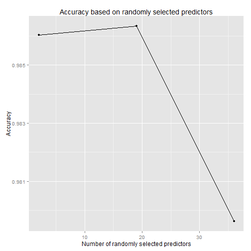

## 1. Introduction

One thing that people regularly do is quantify how much of a particular activity they do, but they rarely quantify how well they do it. In this project, your goal will be to use data from accelerometers on the belt, forearm, arm, and dumbell of 6 participants. They were asked to perform barbell lifts correctly and incorrectly in 5 different ways. 

This was classification with multiple classes problem. Our task was construct a prediction model which will predict as correct as possible the right class. There were 5 classes A, B, C, D and E. We build a model which has an outstanding performance.

## 2. Data

Six young health participants were asked to perform one set of 10 repetitions of the Unilateral Dumbbell Biceps Curl in five different fashions: exactly according to the specification (Class A), throwing the elbows to the front (Class B), lifting the dumbbell only halfway (Class C), lowering the dumbbell only halfway (Class D) and throwing the hips to the front (Class E). Class A corresponds to the specified execution of the exercise, while the other 4 classes correspond to common mistakes. Participants were supervised by an experienced weight lifter to make sure the execution complied to the manner they were supposed to simulate. The exercises were performed by six male participants aged between 20-28 years, with little weight lifting experience. We made sure that all participants could easily simulate the mistakes in a safe and controlled manner by using a relatively light dumbbell (1.25kg).


The data for this project come from this source [1]. We read data provided for this assignment. 


```r
training_data <- read.csv("pml-training.csv")
test_data <- read.csv("pml-testing.csv") 
nrow(training_data)
```

```
## [1] 19622
```

```r
ncol(training_data)
```

```
## [1] 160
```

```r
nrow(test_data)
```

```
## [1] 20
```
Test data in this case has only 20 observations because they are intended for submitting twenty predictions which are second part of this assignment.

## 3. Reading and preprocessing data

Firstly we look at the data and see variables in it, their class, if there are any missing values, etc. Then we try to find appropriate variables for prediction model. After careful considerations we came to the solution.


```r
important_variables <- grep("^pitch|^roll|^yaw|^classe|^gyros|^accel|^magnet ", colnames(training_data))
```

Next was made a sample of data. This is cruical for analysis because data could be in order and then prediction model would have very high error. With sampling we ensure that in any sets there wont be only one class in predict variable. We do this with function createDataPartition() which could be found in caret package. We choose to split it on 50-50.


```r
samples <- createDataPartition(y = training_data$classe, p = 0.5, list = F)
```

Next we split the data on training and test set. As we said above the test data are to small not appropriate for machine learning due to their length so we will split the variable training_data. 


```r
training_set <- training_data[samples,important_variables]
test_set <- training_data[-samples,important_variables]
```

Now we have both, appropriate training and test data. Now it is time to start building a prediction model. 

## 4. Prediction model

We have build few prediction models with different methods. Names of algorithms and their designations are in table below.

| Name of algorithm | Method |
| :---------------: | :----: |
| k-Nearest Neighbor | knn |
| Conditional Inference Tree | ctree |
| Conditional Inference Tree | ctree2 |
| Random Forest | rf |
| CART | rpart |

The best performance with default parameters has a Random forest algorithm so we tune it up. We apply cross validation method K-fold. Parameters we used were; number of folds was 7 and number of repeats was 5. 


```r
model <- train(classe ~ ., data = training_set, method = "rf",
               trControl = trainControl("cv", number = 7, repeats = 5))
model
```

```
## Random Forest 
## 
## 9812 samples
##   36 predictors
##    5 classes: 'A', 'B', 'C', 'D', 'E' 
## 
## No pre-processing
## Resampling: Cross-Validated (7 fold) 
## 
## Summary of sample sizes: 8411, 8409, 8413, 8409, 8410, 8409, ... 
## 
## Resampling results across tuning parameters:
## 
##   mtry  Accuracy  Kappa  Accuracy SD  Kappa SD
##   2     1         1      0.004        0.005   
##   20    1         1      0.004        0.005   
##   40    1         1      0.005        0.006   
## 
## Accuracy was used to select the optimal model using  the largest value.
## The final value used for the model was mtry = 19.
```

We plot how the model was built and its best performance depends on parameter mtry. The optimal parameter has 19 variables included.

```r
g <- ggplot(model)
g + labs(title = "Accuracy based on randomly selected predictors", 
         x = "Number of randomly selected predictors", y = "Accuracy")
```

 


Next we apply our model on test set.

```r
predictions <- predict(model, test_set, type  ="raw")
```

Then we calculated confusion matrix


```r
confusionMatrix(predictions, test_set$classe)
```

```
## Confusion Matrix and Statistics
## 
##           Reference
## Prediction    A    B    C    D    E
##          A 2781   25    0    0    0
##          B    7 1859   19    4    1
##          C    0   12 1678   23    3
##          D    2    2   14 1574    3
##          E    0    0    0    7 1796
## 
## Overall Statistics
##                                        
##                Accuracy : 0.988        
##                  95% CI : (0.985, 0.99)
##     No Information Rate : 0.284        
##     P-Value [Acc > NIR] : <2e-16       
##                                        
##                   Kappa : 0.984        
##  Mcnemar's Test P-Value : NA           
## 
## Statistics by Class:
## 
##                      Class: A Class: B Class: C Class: D Class: E
## Sensitivity             0.997    0.979    0.981    0.979    0.996
## Specificity             0.996    0.996    0.995    0.997    0.999
## Pos Pred Value          0.991    0.984    0.978    0.987    0.996
## Neg Pred Value          0.999    0.995    0.996    0.996    0.999
## Prevalence              0.284    0.193    0.174    0.164    0.184
## Detection Rate          0.283    0.190    0.171    0.160    0.183
## Detection Prevalence    0.286    0.193    0.175    0.163    0.184
## Balanced Accuracy       0.997    0.988    0.988    0.988    0.998
```

In our model in sample error was 0 where parameter mtry = 19 and sample error would be [%]

```r
1 - (sum(predictions==test_set$classe)/nrow(test_set))
```

```
## [1] 0.01244
```


## 5. Conclusion
We apply prediction model based on Random forest algorithm. An algorithm performance was outstandinglly low.

## 6. References

[1] http://groupware.les.inf.puc-rio.br/har#weight_lifting_exercises 
